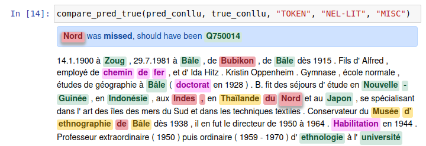

# Jupyter NLP prediction<->ground truth comparator

This small utility allows to compare in Jupyter predictions and ground truth for NLP tasks. 

`examples.ipynb` shows simple examples to get you started.

Here is an example output:



Can be directly installed using pip over git+https:
```
pip install git+https://github.com/dddpt/nlp_pred_true_comparator.git
```

(force-upgrade to bleeding-edge version: ```pip install --upgrade git+https://github.com/dddpt/nlp_pred_true_comparator.git```)

Note: works in vanilla Jupyter, doesn't work in visual studio code. Untested and not guaranteed to work in google-collab/other.